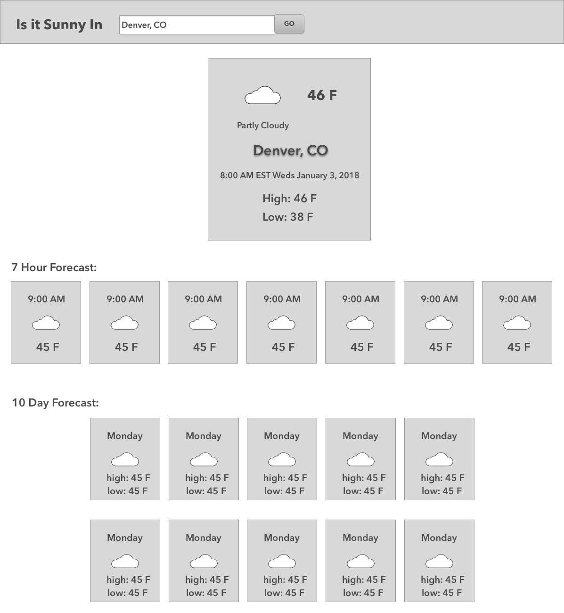

# Weathrly

This Weather App was built for Mod 2 of Turing's Front End Engineering Program using React and the Weather Underground API. Usually assigned as a pair project, I built this application by myself start to finish over the course of a week. 


##Wireframes



##Live Application


To install the dependencies:

```
npm install
```

To fire up a development server:

```
npm start
```

Once the server is running, you can visit:

* `http://localhost:8080/webpack-dev-server/` to run your application.
* `http://localhost:8080/webpack-dev-server/test.html` to run your test suite in the browser.

To build the static files:

```js
npm run build
```
